## Four Sides

## Six Sides

## Eight Sides

## Twelve Sides

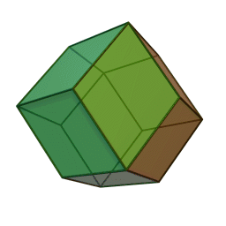

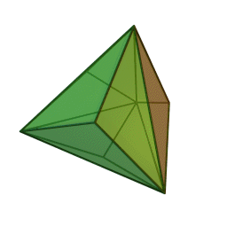

## Twenty Sides

## Twenty-Four Sides
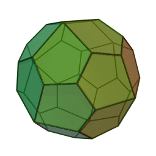

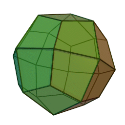

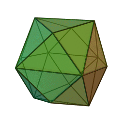

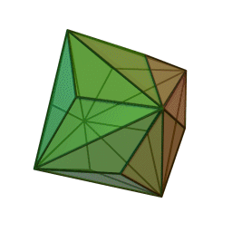

## Thirty Sides
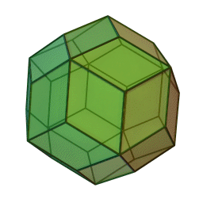

## Fourty-Eight Sides
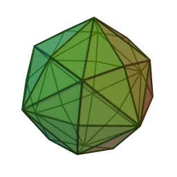

## Sixty Sides
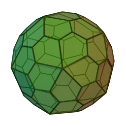

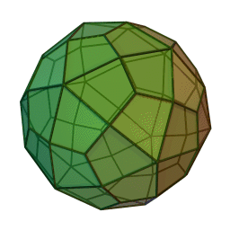

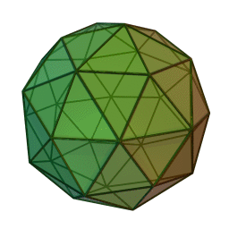

## One Hundred Twenty Sides
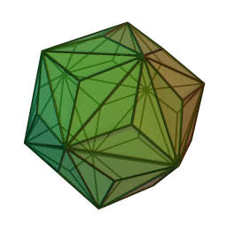
